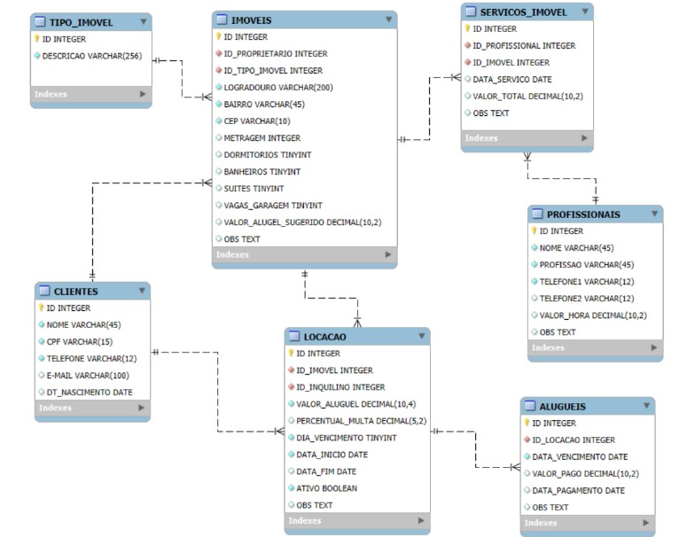

# Sistemas de Informação - DCOMP/IFMA
## Laboratório de Banco de Dados

Laboratório 04 - Data de Entrega: 06-02-2025

# Contexto

Você foi contratado por uma imobiliária para desenvolver um backend de uma aplicação que irá gerenciar suas operações diárias. O sistema deve seguir uma arquitetura em camadas, composta por uma camada de modelo, uma camada de acesso a dados utilizando o padrão repository, e uma camada de serviço para facilitar a implementação de alguns casos de uso.

## PARTE 1: 

Defina as classes do modelo com os mapeamentos JPA para o seguinte diagrama relacional. (4 pt) 

Nomenclatura: Losango preenchido - campo not null
Deverão ser criadas as classes do modelo que representam as entidades do banco juntamente com os seus relacionamentos e os mapeamentos JPA de acordo com o esquema relacional apresentado anteriormente. 
Utilize boas práticas de programação orientada a objetos, como encapsulamento de regras de negócio, coesão e baixo acoplamento. 
**Dica: use o lombok para evitar a escrita de código boilerplate**   
https://www.freecodecamp.org/portuguese/news/o-que-e-um-boilerplate-e-por-que-o-usamos-a-necessidade-de-um-guia-de-esltio-de-codigo/  
 
 ## Parte 2: Implementação da Camada de Acesso a Dados (3 pt) 
 Implementar a camada de acesso a dados com os CRUDs usando o padrão repository:
 - Cadastro de Imóveis (inserir, atualizar e listar todos os imóveis cadastrados).  
   - Verificar se o CPF do cliente é único

  - Cadastro de Profissionais (inserir,atualizar e listar todos os imóve cadastrados). 
  - Cadastro de Locação (inserir, atualizar e listar todas as locações de um determinado cliente), associando um imóvel a um cliente (inquilino).  
  - Verifique a disponibilidade de um imóvel antes de registrá- para uma nova locação.  
    - Possíveis Problemas:  
     - Garantir que o imóvel não esteja alugado. 
      - Verificar se o imóvel está marcado como disponível para locação (ativo).  
  
  - Cadastro de ServicoImovel (inserir, atualizar e listar todas serviços executados para uma determinada locação).
  - Cadastro de Aluguéis (inserir, atualizar e listar todos os aluguéis de um determinado inquilino).  
    - Lista de aluguéis a partir do nome de um cliente (inquilino)  
    - Dado um limite de preço, recuperar todos os imóveis que estão disponíveis, com valor do aluguel (valor_aluguel_sugerido) igual ou inferior ao valor informado.  
    - Lista de aluguéis a par  r do nome de um cliente (inquilino) o Recuperar uma lista com todos os aluguéis que foram pagos com atraso.
  ## Parte 4: Camada de Serviço (3 pt) 
  - Implementação de um serviço de Registrar Locação Esse serviço será responsável por: < 
    - Receber os dados da locação, como o imóvel a ser locado, o cliente (inquilino), a data de início e a data de término da locação, e o valor do aluguel.
    - Verificar a disponibilidade do imóvel. Caso o imóvel esteja disponível, registrar a locação no sistema, atualizando o status do imóvel para "alugado"
  - Implementação de um serviço para o registro de pagamentos do aluguel (2pt)  
    - Registrar Pagamento de Aluguel: Permitir a associação de pagamentos de aluguel a uma locação.  
      - Valor a ser pago com multa: Dado uma data de vencimento e a data de pagamento, calcule o valor a ser pago, incluindo a multa. Se o pagamento estiver dentro do prazo, deverá ser retornado ao valor do aluguel sem acréscimo de multas.  
    **OBS¹ : A multa é calculada da seguinte forma: 0,33% por dia de atraso, limitada a 20% do valor do aluguel.**  
    **OBS² : Desenvolva classes de teste (método main) para cada funcionalidade implementada.**
